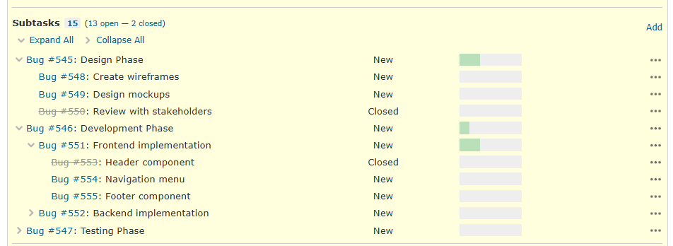

# redmine_studio_plugin

## Overview

This plugin provides features for [Redmine Studio](https://www.redmine-power.com/) (Windows client application provided by Redmine Power).

## Features

- **Reply Button** - Adds a "Reply" button to issues
- **Teams Button** - Adds a "Teams" button to usernames to start a chat
- **Auto Close** - Automatically closes issues based on conditions
- **Date Independent** - Makes parent issue dates independent from child issues
- **Wiki Lists** - Macros to display wiki pages and issue lists
- **Subtask List Accordion** - Adds accordion functionality to the subtask list
- **Plugin API** - API to retrieve plugin information (used internally by Redmine Studio)

## Supported Redmine

- V5.x (Tested on V5.1.11)
- V6.x (Tested on V6.1.1)

## Installation

The Redmine installation path varies depending on your environment.
The following instructions use `/var/lib/redmine`.
Please adjust according to your environment.

| Environment | Redmine Path |
|-------------|--------------|
| apt (Debian/Ubuntu) | `/var/lib/redmine` |
| Docker (Official Image) | `/usr/src/redmine` |
| Bitnami | `/opt/bitnami/redmine` |

### 1. Deploy the plugin

Run the following commands in the Redmine plugins folder.

```bash
cd /var/lib/redmine/plugins
git clone https://github.com/RedminePower/redmine_studio_plugin.git
```

### 2. Install

Run the following command. This command removes old plugins, runs DB migration, and registers cron in one step.
Make sure to run this command in the Redmine installation folder.

```bash
cd /var/lib/redmine
bundle exec rake redmine_studio_plugin:install RAILS_ENV=production
```

### 3. Restart Redmine

Restart Redmine to apply the changes.

## Reply Button

A feature that adds a "Reply" button to issues.


- Clicking the "Reply" button automatically sets the last commenter as the assignee
- If there are no comments, the issue author is set as the assignee
- Enables email-like exchanges on issues, convenient for issue-driven development

For details, see [docs/reply_button-en.md](docs/reply_button-en.md).

## Teams Button

A feature that adds a "Teams" button next to usernames, allowing you to start a chat with one click.


- Clicking the "Teams" button opens a Teams chat with that user
- The chat is pre-filled with issue information (title, URL, issue ID)

For details, see [docs/teams_button-en.md](docs/teams_button-en.md).

## Auto Close

A feature that automatically closes issues (status change, assignee change, comment addition) based on conditions.

- Automatically closes parent issues when all child issues are closed
- Periodically closes expired issues (executed via cron daily at 3:00)
- Flexible condition settings including project, tracker, status, and custom fields

For details, see [docs/auto_close-en.md](docs/auto_close-en.md).

## Date Independent

A feature that makes parent issue start dates and due dates independent from child issues.

Redmine's "Derived from child issues" setting applies system-wide, so you cannot change the behavior per project.
With this feature, you can control synchronization based on specific projects and statuses.

- Make parent issue dates independent for specific projects
- Maintain synchronization for specific statuses (e.g., Closed)

For details, see [docs/date_independent-en.md](docs/date_independent-en.md).

## Wiki Lists

Provides macros to display issue and page lists on Wiki pages.


- `{{wiki_list}}` - Displays a list of wiki pages in table format
- `{{issue_name_link}}` - Creates a link from issue subject
- `{{ref_issues}}` - Displays a list of issues matching conditions

For details, see [docs/wiki_lists-en.md](docs/wiki_lists-en.md).

## Subtask List Accordion

Redmine's subtask list becomes difficult to navigate when the hierarchy is deep.
This feature converts the subtask list into an accordion format with collapse/expand functionality, allowing you to display only the parts you need even with complex issue structures.



- Collapse/expand each level of the subtask list
- Adds "Expand All" and "Collapse All" links at the top of the subtask list
- Context menu options: "Expand this tree", "Collapse this tree", "Expand next level all"

For details, see [docs/subtask_list_accordion-en.md](docs/subtask_list_accordion-en.md).

## Plugin API

| Endpoint | Description |
|----------|-------------|
| `GET /plugins.json` | Get plugin list |
| `GET /plugins/:id.json` | Get single plugin information |

## Uninstall

### 1. Run the uninstall command

Removes cron job and rolls back DB migration.

```bash
cd /var/lib/redmine
bundle exec rake redmine_studio_plugin:uninstall RAILS_ENV=production
```

### 2. Remove the plugin

Remove the plugin folder.

```bash
cd /var/lib/redmine/plugins
rm -rf redmine_studio_plugin
```

## License

GPL v2 License

