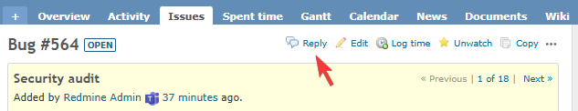

# Reply Button

チケットに「返答」ボタンを追加する機能です。

## 概要

チケット画面に「返答」ボタンを追加し、メールで返信するような感覚でチケット上でやり取りができます。

| 操作 | 動作 |
|------|------|
| 「返答」ボタンをクリック | 最終コメント投稿者が担当者に自動設定される |
| コメントがない場合 | チケット作成者が担当者に設定される |

### ユースケース

- **チケット駆動型の開発** - 担当者を手動で変更する手間なく、素早くやり取りを継続できる
- **問い合わせ対応** - 問い合わせ者と担当者間でスムーズにコミュニケーションが取れる
- **レビュー指摘対応** - レビュー指摘者への回答を効率的に行える

## 有効化

本機能はプロジェクトごとに有効・無効を切り替えられます。
以下の設定を行わないと「返答」ボタンは表示されません。

1. プロジェクトの「設定」を開く
2. 「プロジェクト」タブ内の「モジュール」で「Reply button」にチェックを入れて保存

## 動作仕様

「返答」ボタンをクリックした際の担当者設定ロジック：

| 条件 | 担当者に設定されるユーザー |
|------|---------------------------|
| 最終更新者が他ユーザー | 最終更新者 |
| 最終更新者が自分 | 自分より前の更新者を遡り、最初に見つかった他ユーザー |
| 全更新者が自分 | 自分 |
| チケットにコメントがない | チケット作成者 |

### 直前のコメントが自分の場合

最終更新者が自分自身の場合、自分より前のコメントを遡り、直前の他ユーザーを担当者に設定します。これにより、コメント後に担当者の変更を忘れた場合でも、リプライボタンで正しい相手に担当を戻すことができます。

### 編集ボタンとの違い

| ボタン | 担当者の設定 |
|--------|-------------|
| 返答 | 最終コメント投稿者（またはチケット作成者）に変更 |
| 編集 | 現在の担当者を維持 |
