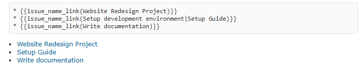

# Wiki Lists

Wiki ページやチケットの説明に、チケットやページの一覧を表示するマクロを提供する機能です。

## 概要

以下の3つのマクロを提供しています：

| マクロ | 説明 |
|--------|------|
| `wiki_list` | Wiki ページの一覧を表形式で表示 |
| `issue_name_link` | チケットの件名からリンクを生成 |
| `ref_issues` | 条件に一致するチケットの一覧を表示 |

### ユースケース

**wiki_list:**
- プロジェクト内の Wiki ページ一覧を表示
- 子ページの一覧を担当者や状態などの情報とともに表示
- Wiki ページ内の特定のキーワードを抽出してテーブル化

**issue_name_link:**
- チケット番号ではなく件名でリンクを作成したい場合
- 別プロジェクトのチケットへのリンクを件名で作成

**ref_issues:**
- カスタムクエリの結果を Wiki ページに埋め込み
- 特定の条件に一致するチケット一覧を動的に表示
- チケット件数のカウント表示

## wiki_list マクロ

Wiki ページの一覧を表形式で表示します。ページ内のテキストから特定のキーワードを抽出して列として表示することもできます。


### 基本構文

```
{{wiki_list([オプション], [カラム指定]...)}}
```

### オプション

| オプション | 説明 |
|-----------|------|
| `-p` | 現在のプロジェクトのページのみ表示 |
| `-p=プロジェクト名` | 指定プロジェクトのページのみ表示 |
| `-c` | 子ページのみを対象にする |
| `-w=幅` | テーブルの横幅を指定（例: `-w=80%`） |

### カラム指定

| 指定形式 | 説明 |
|---------|------|
| `+title` | ページタイトル（リンク付き） |
| `+alias` | ページの別名（リダイレクト） |
| `+project` | プロジェクト名 |
| `キーワード:` | ページ内からキーワード以降の行末までを抽出 |
| `キーワード:\終端` | ページ内からキーワードから終端文字列までを抽出 |

カラム指定には表示名と幅を追加できます：

| 形式 | 説明 |
|------|------|
| `キーワード\|表示名` | カラムヘッダに表示名を使用 |
| `キーワード\|表示名\|幅` | 表示名と列幅を指定 |

### 使用例

- 現在のプロジェクトの全 Wiki ページのタイトル一覧を表示
  ```
  {{wiki_list(-p, +title)}}
  ```

- 子ページのタイトル一覧を「ページ名」というヘッダで表示
  ```
  {{wiki_list(-c, +title|ページ名)}}
  ```

- 現在のプロジェクトのページ一覧と、各ページ内の「担当:」以降のテキストを表示
  ```
  {{wiki_list(-p, +title, 担当:)}}
  ```

- ページ名、担当者、状態の3列を指定の幅で表示（ステータスは改行までを抽出）
  ```
  {{wiki_list(-p, +title|ページ名|200px, 担当:|担当者|150px, ステータス:\n|状態)}}
  ```

- 他のプロジェクトのページ一覧をプロジェクト名とともに表示
  ```
  {{wiki_list(-p=other_project, +title, +project)}}
  ```

## issue_name_link マクロ

チケットの件名からリンクを生成します。チケット番号ではなく、件名でリンクを作成したい場合に便利です。



### 基本構文

```
{{issue_name_link([プロジェクト識別子:]チケット件名[|表示テキスト])}}
```

### パラメータ

| パラメータ | 必須 | 説明 |
|-----------|------|------|
| プロジェクト識別子 | 任意 | 別プロジェクトのチケットを参照する場合に指定 |
| チケット件名 | 必須 | リンク先チケットの件名（完全一致） |
| 表示テキスト | 任意 | リンクに表示するテキスト。省略時はチケット件名 |

### 使用例

- 現在のプロジェクト内で「機能A実装」という件名のチケットへのリンクを生成
  ```
  {{issue_name_link(機能A実装)}}
  ```

- 「バグ修正」へのリンクを「詳細はこちら」というテキストで表示
  ```
  {{issue_name_link(バグ修正|詳細はこちら)}}
  ```

- `other_project` プロジェクト内の「機能B実装」チケットへのリンクを生成
  ```
  {{issue_name_link(other_project:機能B実装)}}
  ```

- 別プロジェクトのチケットへのリンクを表示テキスト付きで生成
  ```
  {{issue_name_link(other_project:機能B実装|機能Bへのリンク)}}
  ```

### 注意事項

- チケット件名は完全一致で検索されます
- 同じ件名のチケットが複数ある場合、最初に見つかったチケットにリンクされます
- プロジェクト識別子はプロジェクト名でも指定可能です

## ref_issues マクロ

条件に一致するチケットの一覧を表示します。カスタムクエリを利用したり、様々なフィルタを指定できます。


### 基本構文

```
{{ref_issues([オプション]..., [カラム]...)}}
```

### オプション

| オプション | 説明 |
|-----------|------|
| `-p` | 現在のプロジェクトのチケットのみ |
| `-p=識別子` | 指定プロジェクトのチケットのみ |
| `-q=クエリ名` | カスタムクエリを名前で指定 |
| `-i=クエリID` | カスタムクエリを ID で指定 |
| `-s=キーワード` | 題名で検索 |
| `-d=キーワード` | 説明で検索 |
| `-w=キーワード` | 題名＋説明で検索 |
| `-f:フィールド=値` | フィルタ条件を指定（複数値は `\|` で区切る） |
| `-n=件数` | 表示件数を制限（デフォルト: 100、最大: 1000） |
| `-t` | 題名をプレーンテキストで表示（デフォルトは subject 属性） |
| `-t=属性` | 指定属性をプレーンテキストで表示 |
| `-l` | 題名をリンクで表示（デフォルトは subject 属性） |
| `-l=属性` | 指定属性をリンクで表示 |
| `-c` | 件数のみ表示 |
| `-0` | 0件の場合は何も表示しない |

### フィルタ条件 (-f オプション)

`-f:フィールド=値` 形式でフィルタ条件を追加できます。

**利用可能なフィールド:**

| フィールド | 説明 |
|-----------|------|
| `status` | ステータス名で指定 |
| `tracker` | トラッカー名で指定 |
| `assigned_to` | 担当者（ログイン名） |
| `author` | 作成者（ログイン名） |
| `category` | カテゴリ名 |
| `version` | 対象バージョン名 |
| `project` | プロジェクト名 |
| `cf_数字` | カスタムフィールド ID |

**演算子:**

フィールドと値の間に演算子を指定できます。

| 演算子 | 説明 |
|--------|------|
| `=` | 等しい（デフォルト） |
| `~` | 含む |
| `!` | 等しくない |
| `!~` | 含まない |
| `o` | 未完了 |
| `c` | 完了 |
| `*` | 任意の値 |
| `!*` | 値なし |

### 特殊な値の参照

フィルタ値に以下の特殊な参照を使用できます：

| 参照 | 説明 |
|------|------|
| `[current_user]` | 現在のユーザーのログイン名 |
| `[current_user_id]` | 現在のユーザーの ID |
| `[current_project_id]` | 現在のプロジェクトの ID |
| `[数字days_ago]` | 指定日数前の日付（例: `[7days_ago]`） |
| `[属性名]` | チケット内での使用時、そのチケットの属性値 |

### カラム指定

オプション以外の引数はカラム名として解釈されます。

**標準カラム:** `id`, `subject`, `status`, `assigned_to`, `author`, `tracker`, `priority`, `category`, `fixed_version`, `start_date`, `due_date`, `estimated_hours`, `done_ratio`, `created_on`, `updated_on` など

**短縮名:**

| 短縮名 | 正式名 |
|--------|--------|
| `assigned` | `assigned_to` |
| `updated` | `updated_on` |
| `created` | `created_on` |

**カスタムフィールド:** `cf_数字` 形式で指定

### 使用例

- 現在のプロジェクトの全チケットを表示
  ```
  {{ref_issues(-p)}}
  ```

- 「未完了チケット」というカスタムクエリの結果を表示
  ```
  {{ref_issues(-q=未完了チケット)}}
  ```

- ID=5 のカスタムクエリの結果を表示
  ```
  {{ref_issues(-i=5)}}
  ```

- 現在のプロジェクトの「新規」または「進行中」ステータスのチケットを表示
  ```
  {{ref_issues(-p, -f:status=新規|進行中)}}
  ```

- 現在のユーザーが担当者のチケットを表示
  ```
  {{ref_issues(-p, -f:assigned_to=[current_user])}}
  ```

- 指定したカラムのみを表示
  ```
  {{ref_issues(-p, id, subject, status, assigned_to)}}
  ```

- 現在のプロジェクトのチケット件数のみを表示
  ```
  {{ref_issues(-p, -c)}}
  ```

- 新規チケットを表示（0件の場合は何も表示しない）
  ```
  {{ref_issues(-p, -f:status=新規, -0)}}
  ```

- 表示件数を50件に制限
  ```
  {{ref_issues(-p, -n=50)}}
  ```

- チケットの題名をリンクとして横並びで表示
  ```
  {{ref_issues(-p, -l)}}
  ```

- 題名に「バグ」を含むチケットを検索
  ```
  {{ref_issues(-s=バグ)}}
  ```

### 表示件数の制限

サーバー保護のため、`-n` オプションを指定しない場合は最大100件まで表示されます。100件を超える場合は警告メッセージが表示されます。

`-n` オプションで最大1000件まで指定可能です。

## 注意事項

これらの Wiki マクロは任意の検索条件でチケット情報を表示できるため、**信頼できるユーザーのみが利用する環境での使用を推奨します**。

Wiki の編集権限を持つユーザーは、以下の情報にアクセスできる可能性があります：
- 別プロジェクトのチケット情報
- 別プロジェクトの Wiki ページ内容
- カスタムフィールドの値
